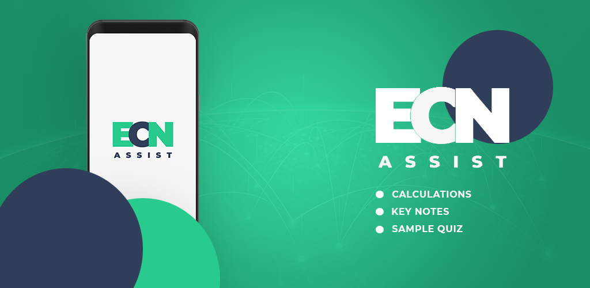

# AngularJS Supply-Demand Curve App

A simple AngularJS web application for supply and demand curve calculations, quizzes, and key notes.


## Features

- Supply and demand curve calculations based on your inputs
- Interactive quizzes for practice
- Key notes for quick study


## Screenshot




## Installation

1. Clone the repository:
   ```bash
   git clone https://github.com/engrsak/ecn.git
2. Open index.php in your browser
